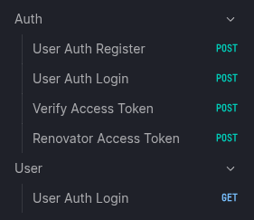

# Autenticação com JWT

Este projeto é uma API desenvolvida com FastAPI que implementa um sistema de autenticação utilizando JWT (JSON Web Tokens). Permite o registro de usuários em um banco de dados local SQLite utilizando SQLAlchemy.

## Funcionalidades

- Registro de usuários
- Autenticação com JWT
- Banco de dados local SQLite com SQLAlchemy
- Estrutura de dados com validação usando Pydantic

## Pré-requisitos

- Python 3.8+
- Recomendo instalar o [uv](https://github.com/astral-sh/uv) para melhor performance e facilidade na gestão de dependências.

## Instalação

1. Clone o repositório:
   ```bash
   git clone https://github.com/IgorDominguez/API-Auth-JWT.git
   cd API-Auth-JWT/
   ```

2. Crie o VENV:
   ```bash
   uv venv .venv
   ```

3. Ative o VENV:
   ```bash
   # Linux/Mac
   source .venv/bin/activate

   # Windows
   .\.venv\Scripts\Activate.ps1
   ```

4. Instale as dependências:
   ```bash
   uv sync
   ```

## Configuração

O arquivo `.env` já vem configurado com valores padrão. Você pode alterá-los se necessário:

```dotenv
SECRET_KEY=sua_chave_secreta
EXP_ACCESS=60   # Tempo de expiração do access_token. Em segundos
EXP_REFRESH=120  # Tempo de expiração do refresh_token. Em segundos
ALGORITHM=HS256
```

## Execução

Entre na pasta `src` e execute o comando abaixo:

```bash
cd src # Entrar na pasta
```
```bash
uvicorn main:app --reload # Executar o servidor
```

A API estará disponível em `http://localhost:8000`.

## Documentação

- **Swagger UI**: [http://localhost:8000/docs#/](http://localhost:8000/docs#/)
- **Scalar**: [http://localhost:8000/scalar](http://localhost:8000/scalar)

## Rotas da API



## Tecnologias Utilizadas

- FastAPI
- SQLAlchemy
- SQLite
- Pyjwt
- Uvicorn
- Pydantic / Pydantic-settings